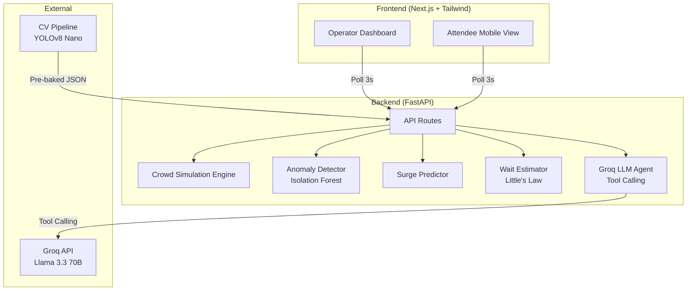

# 🏟️ VenueFlow + SkipLine

> **AI-powered crowd management and concession pre-ordering for large-scale sporting venues.**

Built for hackathon demo — combines real-time crowd simulation, computer vision pipeline, LLM-powered routing, and surge prediction into a unified dashboard.

---

## ✨ Features

### VenueFlow — Crowd Intelligence
- 🗺️ **Live SVG Heatmap** — 12 stadium zones with real-time density color coding
- 🤖 **Agentic AI Ops Assistant** — Staff chat with LLM tool-calling (Groq Llama 3.3)
- 🧭 **AI Navigation** — Natural language routing suggestions for attendees
- 🔍 **Anomaly Detection** — Isolation Forest flags unusual crowd patterns
- 📊 **Predictive Wait Times** — Little's Law estimates per concession stand

### SkipLine — Surge Prediction
- ⚡ **Surge Prediction** — Detects upcoming overcrowding 5-10 min in advance
- 📱 **Push Alerts** — Proactive notifications with pre-order CTAs
- 🍔 **Mobile Pre-Ordering** — Skip the line with advance food orders
- 🎯 **Smart Recommendations** — AI factors in queue length + game time

---

## 🏗️ Architecture



---

## 🛠️ Tech Stack

| Layer | Choice |
|---|---|
| Frontend | Next.js 15 + Tailwind CSS v4 |
| Backend | FastAPI (Python) |
| Package Manager | uv |
| LLM | Groq (Llama 3.3 70B Versatile) |
| ML | scikit-learn (Isolation Forest) |
| Simulation | NumPy |
| CV Demo | YOLOv8 Nano (local only) |
| Deployment | Vercel (frontend) + Render (backend) |

---

## 🚀 Quick Start

### Prerequisites
- Python 3.10+
- [uv](https://docs.astral.sh/uv/) (`curl -LsSf https://astral.sh/uv/install.sh | sh`)
- Node.js 18+
- (Optional) Groq API key — [Get free key](https://console.groq.com)

### Backend

```bash
cd backend

# Install dependencies (creates .venv automatically)
uv sync

# Set up environment
copy .env.example .env       # Windows
# cp .env.example .env       # macOS/Linux
# Edit .env and add your GROQ_API_KEY

# Start server
uv run uvicorn main:app --reload --port 8000
```

### Frontend

```bash
cd frontend

# Install dependencies
npm install

# Start dev server
npm run dev
```

Open [http://localhost:3000](http://localhost:3000) for the dashboard.
Open [http://localhost:3000/attendee](http://localhost:3000/attendee) for the attendee view.

---

## 🔑 Environment Variables

### Backend (`backend/.env`)
```
GROQ_API_KEY=your_groq_api_key_here
```

### Frontend (`frontend/.env.local`)
```
NEXT_PUBLIC_API_URL=http://localhost:8000
```

---

## 📁 Project Structure

```
venueflow-skipline/
├── frontend/                  # Next.js app
│   ├── app/
│   │   ├── page.js            # Main operator dashboard
│   │   ├── attendee/page.js   # Attendee mobile view
│   │   ├── layout.js          # Root layout
│   │   └── globals.css        # Theme & animations
│   ├── components/
│   │   ├── StadiumHeatmap.jsx  # SVG heatmap with zones
│   │   ├── SkipLineAlert.jsx   # Push notification panel
│   │   ├── AttendeeView.jsx    # Pre-order UI
│   │   └── StaffChat.jsx       # LLM ops assistant
│   └── lib/
│       └── api.js              # Backend API client
│
├── backend/                   # FastAPI app (uv managed)
│   ├── pyproject.toml          # Dependencies & project config
│   ├── uv.lock                 # Locked dependency versions
│   ├── main.py                 # FastAPI routes
│   ├── Procfile                # Render start command
│   ├── build.sh                # Render build script
│   ├── simulation/
│   │   ├── engine.py           # Crowd density simulation (NumPy)
│   │   ├── zones.py            # Zone definitions
│   │   └── anomaly_detector.py # Isolation Forest anomaly detection
│   ├── skipline/
│   │   ├── predictor.py        # Surge prediction engine
│   │   ├── notifier.py         # Alert message generator
│   │   └── wait_estimator.py   # Little's Law wait times
│   ├── groq_agent/
│   │   ├── client.py           # Groq API wrapper
│   │   ├── routing_agent.py    # Navigation suggestions
│   │   └── ops_assistant.py    # Agentic tool-calling assistant
│   └── cv_data/
│       └── sample_counts.json  # Pre-baked YOLOv8 output
│
├── cv_demo/                   # Local only, not deployed
│   ├── detect.py               # YOLOv8 detection script
│   └── output/counts.json      # Sample output
│
├── render.yaml                # Render deployment config
└── README.md
```

---

## 🌐 Deployment

### Frontend → Vercel
1. Push to GitHub
2. Import in [Vercel](https://vercel.com)
3. Set root directory to `frontend`
4. Add env: `NEXT_PUBLIC_API_URL` = your Render backend URL

### Backend → Render
1. Push to GitHub
2. New Web Service in [Render](https://render.com)
3. Connect your repo — Render will auto-detect `render.yaml`
4. **Or configure manually:**
   - Root directory: `backend`
   - Build command: `pip install uv && uv sync --frozen --no-dev`  
   - Start command: `uv run uvicorn main:app --host 0.0.0.0 --port $PORT`
5. Add env var: `GROQ_API_KEY`

---

## 🧪 API Endpoints

| Method | Endpoint | Description |
|---|---|---|
| GET | `/api/zones` | Zone definitions |
| GET | `/api/density?minute=N` | Current zone densities |
| GET | `/api/surge?minute=N` | Surge predictions |
| GET | `/api/alerts?minute=N` | SkipLine alerts |
| GET | `/api/wait-times?minute=N` | Concession wait times |
| GET | `/api/anomalies?minute=N` | Anomaly detection |
| POST | `/api/chat` | Staff ops assistant |
| POST | `/api/routing` | AI routing suggestion |
| GET | `/api/menu` | Concession menu |
| POST | `/api/preorder` | Submit pre-order |
| GET | `/api/cv-data` | Pre-baked CV data |

---

## 🧠 AI/ML Techniques

1. **Agentic Tool Calling** — Ops assistant uses Groq function calling to decide which data tools to invoke
2. **Anomaly Detection** — Isolation Forest trained on normal crowd patterns to flag security concerns
3. **Predictive Wait Times** — Little's Law (W = L/λ) applied to concession queue estimation
4. **Surge Prediction** — Sliding window trend analysis with confidence scoring
5. **LLM Routing** — Natural language navigation powered by Llama 3.3 70B

---

## 📄 License

MIT — Built for hackathon demo purposes.
