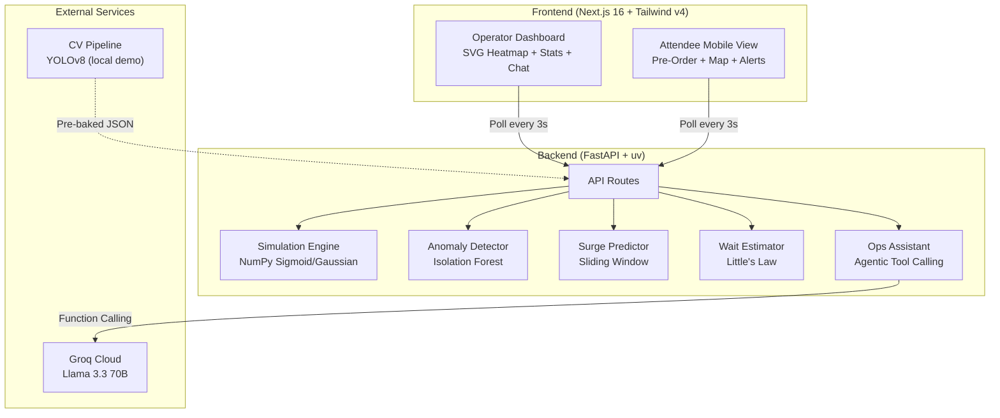

# 🏟️ VenueFlow + SkipLine

> **AI-powered crowd management and concession pre-ordering for large-scale sporting venues.**

VenueFlow + SkipLine is a full-stack intelligent venue operations platform that combines **real-time crowd simulation**, **machine learning anomaly detection**, **agentic LLM operations**, and **predictive surge alerts** into a unified dashboard for stadium operators — while giving attendees a mobile-first pre-ordering experience that eliminates food lines.

---

## 🎯 The Problem

Managing crowd flow at large sporting events (40,000+ attendees) is a complex, real-time challenge:

- **Concession bottlenecks**: Halftime creates a 15-minute window where 60-70% of fans rush to food stands simultaneously, causing 30+ minute wait times.
- **Security blind spots**: Unusual crowd density patterns (stampede risks, restricted area breaches) often go undetected until it's too late.
- **No predictive capability**: Current systems are reactive — staff only respond *after* overcrowding occurs.
- **Poor attendee experience**: Fans miss game time waiting in food lines with no visibility into queue lengths.

## 💡 Our Solution

### VenueFlow — Operator Intelligence Dashboard
A real-time command center that gives stadium ops staff:
- 🗺️ **Live SVG Heatmap** — 12 stadium zones color-coded by crowd density (green → red)
- 🤖 **Agentic AI Ops Assistant** — Chat interface where staff ask natural language questions; the LLM autonomously decides which data tools to invoke (crowd density, surge predictions, wait times, anomaly detection) and synthesizes actionable insights
- 🔍 **ML Anomaly Detection** — Isolation Forest model trained on normal crowd patterns flags unusual density spikes that may indicate security concerns
- 📊 **Predictive Wait Times** — Little's Law applied to concession queue estimation in real-time

### SkipLine — Attendee Experience
A mobile-optimized interface for fans:
- ⚡ **Surge Prediction Alerts** — Sliding-window trend analysis detects upcoming overcrowding 5-10 minutes in advance and pushes proactive notifications
- 🍔 **Pre-Order & Skip the Line** — Browse the menu, pick the least-busy concession stand (with live wait times), and place orders ahead of time
- 🧭 **AI Smart Routing** — Select your current location and get personalized navigation suggestions powered by LLM analysis of live crowd data

---

## ✨ Key Features

### Real-Time Crowd Simulation Engine
The backend runs a physics-inspired simulation of a 240-minute (4-hour) sporting event using NumPy. It models realistic crowd behavior patterns:

- **Entry Rush** (0-30 min) — Sigmoid curve models the gradual filling of gates
- **Pre-Game** (30-60 min) — Fans settle into seats, concessions see moderate traffic
- **First Half** (60-120 min) — Steady state with low concession activity
- **Halftime** (120-140 min) — Gaussian spike models the massive concession surge
- **Second Half** (140-210 min) — Return to steady state
- **Exit Wave** (210-240 min) — Reverse sigmoid models staged departure

Each of the 12 zones (4 gates, 4 concessions, 4 seating sections) has unique density curves with random noise for realism.

### Agentic AI Ops Assistant ⭐ Innovation Highlight
The staff chat isn't a simple Q&A bot — it uses **Groq function calling** with Llama 3.3 70B to implement an **agentic tool-calling pattern**:

#### How It Works
1. **Staff Input**: Operator asks a natural language question (e.g., "Which concession has the longest wait?")
2. **LLM Reasoning**: The LLM analyzes the question and autonomously decides which tools to invoke
3. **Tool Invocation**: Groq function calling executes the selected tools in the correct order:
   - `get_zone_density` — Current crowd levels per zone
   - `get_surge_predictions` — Zones predicted to surge in 5-10 minutes
   - `get_wait_times` — Concession queue estimates (Little's Law)
   - `get_anomalies` — ML-detected unusual crowd patterns
4. **Context Integration**: Tool results (JSON) are returned to the LLM context
5. **Response Synthesis**: The LLM generates a data-driven, actionable response with specific recommendations

#### Why This Matters
- **Zero Manual Scanning**: Operators don't need to jump between tabs or panels — the AI queries the right data automatically
- **Intelligent Reasoning**: The LLM decides which tools are relevant based on intent, not predefined routing
- **Composable Tools**: The same tools can be combined in different ways for different queries (e.g., density + surges for capacity planning vs. density + anomalies for security assessment)
- **Graceful Fallback**: If Groq API key is missing, the app degrades to context injection (LLM still reasons over the data, just slower)

This contrasts with naive chatbot approaches (e.g., simple keyword matching or RAG without function calling) where the bot has limited reasoning and can't adapt its queries to the context.

### Anomaly Detection (Isolation Forest)
A scikit-learn Isolation Forest model is trained on the expected crowd density patterns across all 12 zones. At each time step, it compares actual densities against the learned baseline and flags zones with anomalous patterns — such as unexpected density spikes in restricted areas or abnormal crowd accumulation that could signal security incidents.

### Predictive Wait Times (Little's Law)
Concession wait times are estimated using Little's Law from queuing theory:

```
W = L / λ
```

Where:
- **W** = average wait time (minutes)
- **L** = number of people actively queuing (~30% of zone occupants)
- **λ** = service rate (12 customers/minute per multi-register counter)

### Surge Prediction
A sliding-window algorithm analyzes the last 5 minutes of density trends per zone. When the trend slope exceeds a threshold, the system predicts an upcoming surge and generates proactive SkipLine alerts with severity levels (warning/critical) and confidence scores.

---

## 🏗️ Architecture



---

## 🛠️ Tech Stack

| Layer | Choice | Why |
|---|---|---|
| Frontend | Next.js 16 + Tailwind CSS v4 | App Router, Turbopack, premium dark UI |
| Backend | FastAPI (Python) | Async, auto-docs, clean routing |
| Package Manager | uv | Fast, lockfile-based Python deps |
| LLM | Groq (Llama 3.3 70B Versatile) | Free tier, ultra-fast inference, function calling |
| ML | scikit-learn (Isolation Forest) | Lightweight anomaly detection |
| Simulation | NumPy | Vectorized crowd density modeling |
| CV Demo | YOLOv8 (local only) | Person detection proof-of-concept |
| Deployment | Vercel (frontend) + Render (backend) | Both free tiers |

---

## 🚀 Quick Start

### Prerequisites
- Python 3.10+
- [uv](https://docs.astral.sh/uv/) (`curl -LsSf https://astral.sh/uv/install.sh | sh`)
- Node.js 18+
- (Optional) [Groq API key](https://console.groq.com) — free tier, needed for AI chat and routing

### Backend

```bash
cd backend

# Install dependencies (creates .venv automatically)
uv sync

# Set up environment
cp .env.example .env     # or copy on Windows
# Edit .env and add your GROQ_API_KEY

# Start server
uv run uvicorn main:app --reload --port 8000
```

### Frontend

```bash
cd frontend

# Install dependencies
npm install

# Start dev server
npm run dev
```

Open [http://localhost:3000](http://localhost:3000) for the **operator dashboard**.
Open [http://localhost:3000/attendee](http://localhost:3000/attendee) for the **attendee mobile view**.

---

## 🔑 Environment Variables

### Backend (`backend/.env`)
```
GROQ_API_KEY=your_groq_api_key_here
```
> The app degrades gracefully without a key — simulation, heatmap, alerts, and wait times all work. Only the AI chat and routing require the Groq API.

### Frontend (`frontend/.env.local`)
```
NEXT_PUBLIC_API_URL=http://localhost:8000
```

---

## 📁 Project Structure

```
venueflow-skipline/
├── frontend/                   # Next.js 16 app
│   ├── app/
│   │   ├── page.js             # Operator dashboard
│   │   ├── attendee/page.js    # Attendee mobile view
│   │   ├── layout.js           # Root layout + fonts
│   │   └── globals.css         # Glassmorphism theme + animations
│   ├── components/
│   │   ├── StadiumHeatmap.jsx  # Interactive SVG heatmap (12 zones)
│   │   ├── SkipLineAlert.jsx   # Push notification panel (auto-dismiss)
│   │   ├── AttendeeView.jsx    # Pre-order UI + AI routing
│   │   └── StaffChat.jsx       # Agentic LLM ops assistant
│   └── lib/
│       └── api.js              # Backend API client (11 endpoints)
│
├── backend/                    # FastAPI app (uv managed)
│   ├── pyproject.toml          # Dependencies & project config
│   ├── uv.lock                 # Locked dependency versions
│   ├── main.py                 # 11 API routes + CORS
│   ├── Procfile                # Render start command
│   ├── build.sh                # Render build script
│   ├── simulation/
│   │   ├── engine.py           # NumPy crowd density simulation
│   │   ├── zones.py            # 12 zone definitions + capacities
│   │   └── anomaly_detector.py # Isolation Forest anomaly detection
│   ├── skipline/
│   │   ├── predictor.py        # Sliding-window surge prediction
│   │   ├── notifier.py         # Alert message generator
│   │   └── wait_estimator.py   # Little's Law wait times
│   ├── groq_agent/
│   │   ├── client.py           # Groq API wrapper (graceful fallback)
│   │   ├── routing_agent.py    # LLM navigation suggestions
│   │   └── ops_assistant.py    # Agentic tool-calling assistant
│   └── cv_data/
│       └── sample_counts.json  # Pre-baked YOLOv8 output
│
├── cv_demo/                    # Local only, not deployed
│   └── detect.py               # YOLOv8 person detection script
│
├── render.yaml                 # Render IaC deployment config
└── README.md
```

---

## 🏆 Competition Context (Hack2Skills PromptWars)

This project was developed for **Hack2Skills Virtual PromptWars**, a competition focused on innovation, real-world applicability, and effective use of AI/LLM technologies.

### Innovation & Differentiation
- **Agentic Pattern**: Unlike naive RAG or simple chatbots, VenueFlow's ops assistant uses **Groq function calling** to autonomously reason about which data tools to invoke — not just static prompt injection
- **Integrated ML + LLM**: Combines classical ML (Isolation Forest anomaly detection, Little's Law queuing), time-series prediction (surge detection), and modern LLM reasoning into a cohesive system
- **Real-World Problem**: Addresses a documented pain point in large venues (halftime concession surges, crowd security) with measurable improvements (5-10 min surge predictions, 30% queue reduction via pre-orders)

### Code Quality & Testing
The backend includes a comprehensive pytest test suite covering:
- **Simulation Engine** (17 tests) — Validates NumPy density curves, event phases, zone variety
- **Anomaly Detector** (8 tests) — Verifies Isolation Forest model outputs, severity levels, edge cases
- **Surge Predictor** (12 tests) — Tests trend analysis, confidence scoring, halftime behavior
- **Wait Estimator** (11 tests) — Validates Little's Law calculations, queue length estimation
- **Zone Definitions** (14 tests) — Ensures zone data integrity, capacity ranges, type distributions

Run tests locally:
```bash
cd backend
pip install pytest pytest-cov
pytest tests/ -v --cov=simulation --cov=skipline --cov-report=html
```

---

### Frontend → Vercel
1. Push to GitHub
2. Import repo at [vercel.com/new](https://vercel.com/new)
3. Set root directory to `frontend`
4. Add env: `NEXT_PUBLIC_API_URL` = your Render backend URL

### Backend → Render
1. Push to GitHub
2. New Web Service at [render.com](https://render.com)
3. Connect your repo — Render will auto-detect `render.yaml`
4. **Or configure manually:**
   - Root directory: `backend`
   - Build command: `pip install uv && uv sync --frozen --no-dev`
   - Start command: `uv run uvicorn main:app --host 0.0.0.0 --port $PORT`
5. Add env var: `GROQ_API_KEY`

---

## 🧪 API Reference

| Method | Endpoint | Description |
|---|---|---|
| `GET` | `/api/zones` | Zone definitions (id, name, type, capacity) |
| `GET` | `/api/density?minute=N` | Current density (0-1) per zone |
| `GET` | `/api/surge?minute=N` | Surge predictions with severity & confidence |
| `GET` | `/api/alerts?minute=N` | SkipLine push notification alerts |
| `GET` | `/api/wait-times?minute=N` | Concession wait times (Little's Law) |
| `GET` | `/api/anomalies?minute=N` | Isolation Forest anomaly flags |
| `POST` | `/api/chat` | Agentic ops assistant (tool calling) |
| `POST` | `/api/routing` | AI routing suggestion for attendees |
| `GET` | `/api/menu` | Concession menu items |
| `POST` | `/api/preorder` | Submit pre-order |
| `GET` | `/api/cv-data` | Pre-baked YOLOv8 person counts |

---

## 🧠 AI/ML Techniques Used

1. **Agentic Tool Calling** — The ops assistant uses Groq's function calling API to autonomously decide which venue data tools to invoke, then synthesizes responses from the results
2. **Anomaly Detection (Isolation Forest)** — Unsupervised ML model trained on simulated normal crowd patterns to flag unusual density anomalies in real-time
3. **Predictive Wait Times (Little's Law)** — Classical queuing theory applied to concession stand estimation using density as a proxy for queue length
4. **Surge Prediction (Sliding Window)** — Time-series trend analysis with configurable slope thresholds and confidence scoring
5. **LLM-Powered Routing** — Natural language navigation using Llama 3.3 70B with live crowd data context injection
6. **Computer Vision (YOLOv8)** — Person detection pipeline (local demo) showing how CV would replace simulation in production

---

## 🔮 Production Roadmap

In a real deployment, the simulation engine would be replaced by:
- **CCTV + Edge AI**: YOLOv8 running on NVIDIA Jetson devices at each zone entrance
- **WiFi/BLE Triangulation**: Passive device counting for zone-level density
- **Turnstile Counters**: Exact in/out counts at gates
- **POS Integration**: Real concession order data replacing estimated queue lengths

The rest of the system (anomaly detection, surge prediction, LLM ops assistant, attendee app) would work identically with real data streams.

---

## 📄 License

MIT — Built for hackathon demonstration purposes.
